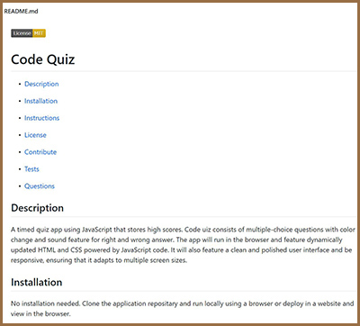

 

# Links to walkthrough video and repository:

* [Repository](https://github.com/sskumar4/READMEGenerator)
* [Link to walkthrough video](https://bit.ly/39ucNEf)

# Title: READMEGenerator

# Introduction:   
Create a command-line application that dynamically generates a professional README.md from a user's input using the inquirer package. The application will be invoked with the following command: node index.js

# Technologies: 
Javascript

# Features
Created the following 
js file: index.js
  
Features of the application:
  * README generator that can quickly create a professional README for a new project
  * When the user is prompted for information about the application repository, a quality, professional README.md is generated with the title of the project and sections entitled Description, Table of Contents, Installation, Usage, License, Contributing, Tests, and Questions
  * When the user enters the project title it is displayed as the title of the README
  * When the user enters a description, installation instructions, usage information, contribution guidelines, and test instructions then the information is added to the sections of the README entitled Description, Installation, Usage, Contributing, and Tests
  * When the user selects a license for the application from a list of options then a badge for that license is added at the top of the README and a notice is added to the section of the README entitled License that explains which license the application is covered under
  * When the user enter the GitHub username it is added to the section of the README entitled Questions, with a link to the GitHub profile
  * When the user enter the email address the email is added to the section of the README entitled Questions, with instructions on how to reach me with additional questions
  * When the user clicks on the links in the Table of Contents then the user is taken to the corresponding section of the README

#Sample README.md created using the application

# Code Quiz

## Table of Contents
* [Description](#Description)

* [Installation](#Installation)

* [Instructions](#Instructions)

* [License](#License)

* [Contribute](#Contribute)

* [Tests](#Tests)

* [Questions](#Questions)
## Description
A timed quiz app using JavaScript that stores high scores. Code uiz consists of multiple-choice questions with color change and sound feature for right and wrong answer. The app will run in the browser and feature dynamically updated HTML and CSS powered by JavaScript code. It will also feature a clean and polished user interface and be responsive, ensuring that it adapts to multiple screen sizes.

## Installation
No installation needed. Clone the application repositary and run locally using a browser or deploy in a website and view in the browser.

## Instructions
User is presented with a start quiz button to begin the quiz. A timer starts with total 75 secs in the top right of the app and immediately the user is presented with a question. When one question is answered, the user is presented with another question (Upto seven questions). A "Right" or "Wrong" message is displayed below the multiple choice questions when a user selects an answer. When the answer is correct, a sound is heard and the button color turns green. When the answer is incorrect, a sound is heard and the button color turns red. Also 10 seconds is subtracted from the timer for each incorrect answer. The quiz ends When all questions are answered or the timer reaches 0. When the quiz is over, the user can save their initials and the time score. The user can start a new quiz by clicking "Go Back" button.
## License 
This project is licensed under the [Apache-2.0](https://opensource.org/licenses/Apache-2.0) License.  
## Contribute
Please use my e-mail to contact me on how to contribute to this project.
## Tests
No automated tests written for this app. Launch the app and answer the questions, a README.md is generated at the end.
## Questions
https://github.com/sskumar4
